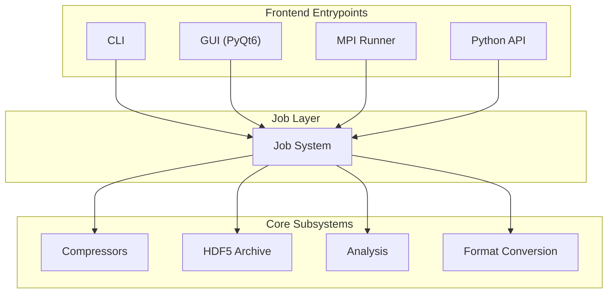

<style>
:root {
  --slidev-theme-primary: #2E2D62;
  --slidev-theme-secondary: #1E5DF8;
  --slidev-theme-accent: #00A788;
}

.slidev-layout.cover  {
  background-color: #2E2D62;
  color: #FFFFFF;
}

h1 {
  color: #00A788; /* Using your Accent color for the Title */
}


</style>

# EMencode - March 2026

Data compression and archival workflows for cryoEM datasets


---
layout: center
---

<Toc minDepth="1" maxDepth="1" />

---
layout: image-right
image: /img/workflow.png
backgroundSize: contain
---

# Background

- eBIC at Diamond provides national access to Cryo-EM for researchers in the structural biology community

- Cryo-EM generates a large quantity of data - in 2023 eBIC accumulated 9.6PB of data relating to microscopes alone.

- Various work to help with this:
    - Removing storage of redundant data (motion corrected micrographs - **~83%** of processed data saved)
    - **Improving compression of the raw data**

---

# Data Compression

- Raw data at eBIC is currently stored as LZW-compressed TIFF files, achieving compression ratios of ~4.
- EMencode started out as benchmarking project to investigate better compression methods for both long and short-term data storage
- Various lossless compression algorithms benchmarked by Mariam, blosc-zstd compression showed **~25%** improvement to compression ratios over LZW.
- Future work was to investigate lossy compression algorithms, and build a dedicated compression/archival tool for eBIC to use.


---

# EMencode

- Developed from a benchmarking framework to a more general purpose cryo-EM compression and data archival package.
- Various new features:
    - HDF5 archival workflow
    - Extra compression algorithms, namely lossy bit-truncation
    - File format conversion tools (tiff to mrc, and Ome-Zarr support)
    - Addition of some preliminary compression analysis tools
    - User friendly CLI, GUI and python API interfaces
    - Plugin system for supporting future compressors, file formats etc.


---

# Interface — Architecture



---
layout: two-cols-header
---

# Interface — CLI & GUI

::left::

<div class="flex flex-col items-center justify-center h-full">
  <p class="text-sm font-bold opacity-60 mb-2">CLI</p>
  
</div>

::right::

<div class="flex flex-col items-center justify-center h-full">
  <p class="text-sm font-bold opacity-60 mb-2">GUI</p>
  
</div>


---

# HDF5 Archival

- Bundles compressed files into a single structured HDF5 archive with full metadata preservation
- "Keeps things tidier", but also allows for better data accessibility
- **Two storage modes:**
    - **Structured** — stores raw numpy arrays with native HDF5 compression (gzip, lz4, zstd)
    - **Blob** — storing pre-compressed data as binary blobs. Good for lossy compressed data.

- MRC headers (or any other metadata in future) preserved alongside data
- Full pipeline in one command: `emencode_pipeline` runs compress → headers → archive

```
archive.h5
├── archive_metadata/        (manifest, scheme, version, file count)
├── tiff_entries/             (per-file blob or structured datasets + auxiliary files)
├── mrc_entries/              (per-file blob or structured datasets)
└── mrc_headers/              (binary headers + quick-access attributes)
```

---

# Format Conversion

- **TIFF → MRC**
    - Direct conversion with header generation, supports single images and multi-frame stacks.
    - RELION already supports compressed MRC files (ish)


- **TIFF/MRC → OME-Zarr**
    - Cloud native image storage format, which EMPIAR is moving towards.
    - EMencode supports both OME-Zarr **v0.4** (Zarr v2) and **v0.5** (Zarr v3 with sharding)
    - Has support for the various bells-and-whistles (codecs, sharding, pyramid generation etc)

---
layout: image-right
image: /img/truncate.jpg
backgroundSize: contain
---

# Lossy Compression - Bit Truncation

- Based on **Fluty & Ludtke 2022** — 5 bits of precision is sufficient for raw cryo-EM data
- Clamp outliers at ±4σ → quantize float32 to 5-bit (32 levels) → store as uint8 TIFF with LZW
- Re-implemented in EMencode, using Numba for acceleration when available
- Haven't been able to properly benchmark due to issues with diamond access

---

# Quality Analysis

- Built-in analysis toolkit to validate compression quality, mainly for lossy schemes.

- **Metrics:** FRC, signal-to-noise ratio, signal error stats, power spectra

- **Fourier Ring Correlation (FRC):** Measures preservation at each spatial frequency
    - Computes cross-correlation on concentric rings in Fourier space
    - Two standard thresholds: 0.5 (half-bit) and 0.143 (gold-standard)

- Results saved to disk as numpy & json output, alongside summary dashboards

- Available via CLI (`emencode_analysis`), GUI tab, or Python API

---

# Quality Analysis — Dashboard

6-bit truncation (no clamping) on a RELION 3.0 motion-corrected micrograph (Falcon-III, 3838×3710 px, float32). **6.5× compression**, correlation 0.997, FRC ≈ 1.0 at all frequencies.
(Random aside: threw claude at this and found my code supported mrc with minimal modification needed)


---

# Long-term Sustainability

- **Sphinx documentation:** API reference, architecture docs, tutorials etc.
- **Extensive tests for everything:** Compressors, I/O, job system etc
- **Plugin system via entry points:** new compressors, formats, or jobs can be added as separate packages without touching EMencode core
- **Nix flake:** `nix develop` gives you Python 3.10, Qt6, HDF5, MPI, blosc, zstd, etc. Please use this!
- **CI/CD:** automated test runs and docs builds on MRs

- EMencode developed very quickly over the past couple months working with AI, but been very careful to get things *right.* :)

---

# Future Work

- **Immediate:**
    - Getting EMencode installed on Diamond
    - Pipeliner integration (had some issues last time round, but should be easier now)
    - Benchmarking of bit truncation and addition of other lossy compression algorithms
    - Improving compressed data support in RELION (blosc-zstd isn't supported atm)

- **Nice-to-haves, not urgent:**
    - Unify HDF5 and Zarr archival behind one interface (`ArchiveJob --backend zarr`)
    - Read OME-Zarr into analysis and conversion pipelines
    - Better format-conversion backend, currently a bit disparate with multiple ad-hoc jobs

---
layout: center
hideInToc: True
---

# **Any questions?**

Links:
- EMencode Repository: https://gitlab.com/ccpem/data-compression-framework
- Toy version in rust: https://gitlab.com/willow-sparks/emencode-rs

